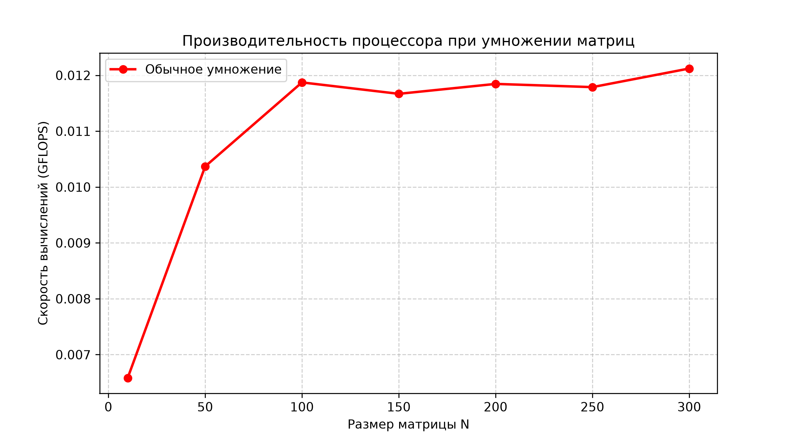

# Лабораторная работа №1

### Реализованный функционал:
1. **C++ Программа:** Читает матрицы из файлов, выполняет вычисления по классическому алгоритму, фиксирует время работы и объем задачи, сохраняет результаты.
2. **`generate.py` (Python)**: Автоматическая генерации тестовых данных. Создает квадратные матрицы заданного размера, заполняя их случайными вещественными числами, и сохраняет их в `matrixA.txt` и `matrixB.txt`.
3. **Python Верификация (`verify.py`):** Автоматически вызывается из C++ кода, проверяет корректность вычислений с помощью библиотеки `NumPy`.
4. **Python Бенчмарк (`plot_perf.py`):** Оценивает производительность системы в GFLOPS при изменении размера задачи.

---

## Анализ производительности

В ходе работы был проведен анализ эффективности алгоритма на различных объемах данных (от $10\times10$ до $500\times500$). Результаты замера производительности в **GFLOPS** представлены на графике ниже:

---

### Требования:
* Компилятор C++
* Python 3.x + библиотеки `numpy`, `matplotlib`
