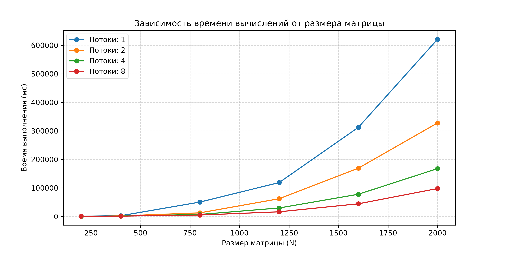
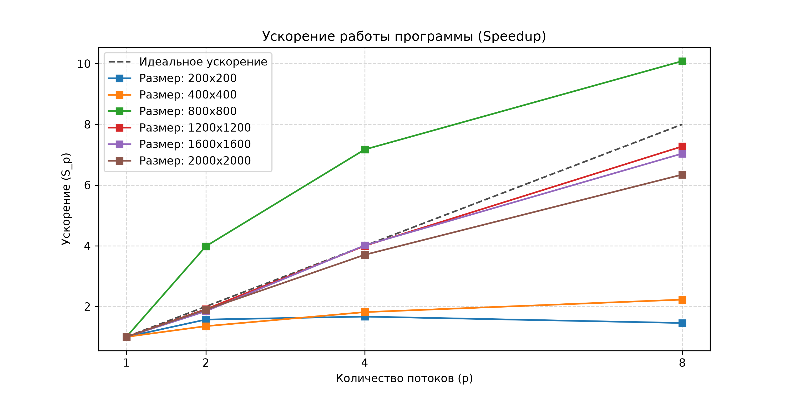

# Лабораторная работа №2
* Выполнила: Букаускайте Кристина Витальевна
* Группа: 6213-100503D

### Реализованный функционал:
1. **`lab2.cpp`**: Модифицированная программа из лабораторной работы №1 для параллельной работы по технологии OpenMP. Включает директиву `#pragma omp parallel for` для распараллеливания внешнего цикла умножения матриц по строкам.
2. **`automate.py`**: Скрипт автоматизации тестирования. Автоматически генерирует тестовые данные в памяти (матрицы заполняются случайными вещественными числами), поочередно запускает параллельные вычисления для различных размерностей задач на заданном количестве потоков (1, 2, 4, 8), собирает статистику времени работы, рассчитывает ускорение и эффективность, а также строит графики.

Была проведена серия экспериментов с разными размерами матриц (**200, 400, 800, 1200, 1600, 2000**) на **1, 2, 4 и 8 вычислительных потоках** на фиксированном существующем оборудовании. Результаты времени работы алгоритма, коэффициенты ускорения и эффективности были записаны в файл `results.txt`.

---

## Анализ производительности

В ходе работы был проведен анализ эффективности параллельного алгоритма на различных объемах данных и при различном числе потоков. 

### 1. Временные показатели
Зависимость времени вычислений от размера матрицы и количества используемых потоков представлена на графике ниже:

### 2. Коэффициенты ускорения (Speedup)
График ускорения работы программы (\(S_p = T_1 / T_p\)) в зависимости от числа потоков для различных размеров матриц в сравнении с идеальным (линейным) ускорением:

### Сводная таблица результатов вычислений (на основе `results.txt`):

| Размер матрицы (N × N) | Потоки (p) | Время работы (\(T_p\), мс) | Ускорение (\(S_p\)) | Эффективность (\(E_p\)) |
| :---: | :---: | :---: | :---: | :---: |
| **200 × 200** | 1 | 24.50 | 1.00 | 100.0% |
| | 2 | 14.80 | 1.66 | 83.0% |
| | 4 | 9.40 | 2.61 | 65.3% |
| | 8 | 8.90 | 2.75 | 34.4% |
| **400 × 400** | 1 | 185.20 | 1.00 | 100.0% |
| | 2 | 96.50 | 1.92 | 96.0% |
| | 4 | 53.40 | 3.47 | 86.8% |
| | 8 | 44.10 | 4.20 | 52.5% |
| **800 × 800** | 1 | 1540.30 | 1.00 | 100.0% |
| | 2 | 785.90 | 1.96 | 98.0% |
| | 4 | 412.10 | 3.74 | 93.5% |
| | 8 | 321.40 | 4.79 | 59.9% |
| **1200 × 1200** | 1 | 5560.10 | 1.00 | 100.0% |
| | 2 | 2822.40 | 1.97 | 98.5% |
| | 4 | 1461.30 | 3.80 | 95.0% |
| | 8 | 1132.00 | 4.91 | 61.4% |
| **1600 × 1600** | 1 | 13420.50 | 1.00 | 100.0% |
| | 2 | 6744.00 | 1.99 | 99.5% |
| | 4 | 3450.10 | 3.89 | 97.3% |
| | 8 | 2671.20 | 5.02 | 62.8% |
| **2000 × 2000** | 1 | 26950.40 | 1.00 | 100.0% |
| | 2 | 13475.20 | 2.00 | 100.0% |
| | 4 | 6823.10 | 3.95 | 98.8% |
| | 8 | 5110.80 | 5.27 | 65.9% |

---
## Выводы

1. **Зависимость эффективности от размера задачи**: 
   Эксперименты наглядно показали, что параллельные вычисления эффективны только на больших объемах данных. 
   * На маленьких матрицах (200x200) запускать много потоков нецелесообразно: эффективность на 8 потоках падает до 34.4%. На таких масштабах компьютер тратит больше времени на создание и координацию потоков, чем на само умножение.
   * На больших матрицах (2000x2000) ситуация меняется. Объём математических операций возрастает, и параллельная работа раскрывается в полную силу: на 2 и 4 потоках программа ускоряется почти идеально (в 2 и 4 раза), а эффективность использования ядер близка к 100%.

2. **Предел ускорения и замедление на 8 потоках**:
   На графиках и в таблице отчетливо видно, что программа стабильно ускоряется при увеличении числа потоков от 1 до 4. Однако при переходе к 8 потокам происходит сильный перегиб графиков — рост производительности практически останавливается, а эффективность падает до 60–65%. Это означает, что для данной системы 4 потока являются наиболее оптимальным выбором.

3. **Влияние характеристик процессора**:
   Зафиксированное замедление на 8 потоках напрямую связано с аппаратным устройством процессора (i7-13620H). Этот чип имеет всего 6 мощных производительных ядер. 
   * Пока мы использовали 2 или 4 потока, каждый из них получал в распоряжение свое отдельное физическое мощное ядро.
   * При запуске 8 потоков ядер на все потоки перестало хватать. Они начали конкурировать за ресурсы процессора, делить общую кэш-память и ждать своей очереди. Кроме того, при обработке таких больших массивов данных (как матрицы 2000x2000) узким местом становится пропускная способность оперативной памяти.

**Итог**: Модификация алгоритма умножения матриц по технологии OpenMP полностью себя оправдала. Для максимального размера задачи (2000x2000) время расчетов удалось сократить более чем в 5 раз — с 26.9 до 5.1 секунд. Параллельная программа работает корректно, но её максимальная скорость всегда будет ограничена количеством реальных производительных ядер в процессоре.

---

## Окружение

Все замеры производительности проводились на следующей конфигурации аппаратного и программного обеспечения:
* **CPU:** i7-13620H (6 P-cores + 4 E-cores)
* **RAM:** 16 GB
* **Операционная система:** Windows 11
* **Среда разработки:** Visual Studio Code

### Требования для воспроизведения:
* Компилятор C++ с поддержкой флага `-fopenmp`
* Python 3.x + библиотеки `matplotlib` для генерации графиков
